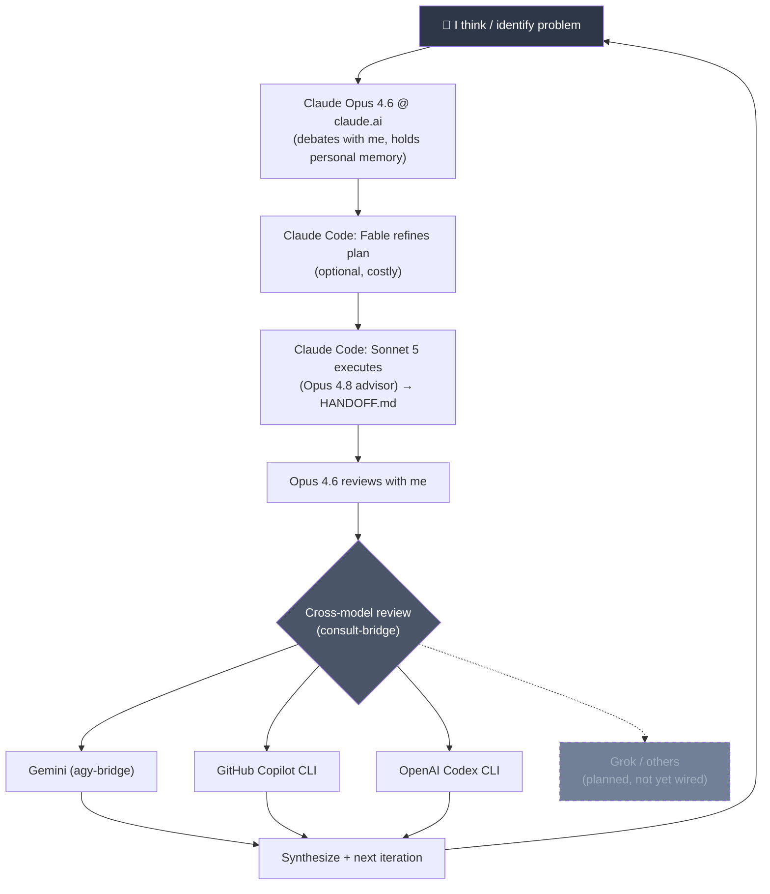

# claude-bridges

MCP servers that let Claude Code delegate to other coding CLIs — cross-model second opinions, structured reviews, and a multi-engine consultation panel.

Most people use AI to autocomplete or to ask one model one question. I use multiple models as a structured thinking system with checks and balances: debate, execute, review, cross-check, iterate.

## The Thinking Loop



This isn't "ask ChatGPT." Each model has a role, a sandbox, and a review gate. No single model's output ships unchecked.

## What's Actually Wired

The `consult` tool currently fans out to **three engines**:

| Engine | Wraps | Tier |
|---|---|---|
| `copilot` | GitHub Copilot CLI (`copilot -p`) | Free (GitHub) |
| `codex` | OpenAI Codex CLI (`codex exec`) | Free (ChatGPT) |
| `agy` | Antigravity / Gemini CLI | Paid (Gemini Pro/Flash) |

Grok and others are in the aspirational loop but don't have bridges yet. The system is designed to add engines — each is ~30 lines in `lib/engines.js`.

## Architecture

```
claude-bridges/
  package.json            shared deps (@modelcontextprotocol/sdk, zod)
  node_modules/           one install serves all bridges
  lib/
    common.js             shared MCP boilerplate, CLI runner, exe resolution
    engines.js            slim engine runners for consult-bridge's chain
  copilot-bridge/
    index.js              standalone MCP server → copilot_exec tool
  codex-bridge/
    index.js              standalone MCP server → codex_exec tool
  consult-bridge/
    index.js              aggregator MCP server → consult tool
  agy-bridge-vendored/    vendored copy of the agy-bridge (Gemini)
```

Three independent MCP servers, each usable standalone or through the `consult` aggregator:

| Bridge | Tool | Default Posture |
|---|---|---|
| `copilot-bridge` | `copilot_exec` | Restrictive: no file writes, only read/search/git-gh shell auto-approved |
| `codex-bridge` | `codex_exec` | Sandboxed `read-only` |
| `consult-bridge` | `consult` | Aggregator: runs engines in parallel (`mode: all`) or sequential fallback (`mode: first`) |

`consult-bridge` deliberately does NOT reuse the individual bridges' code paths — `lib/engines.js` duplicates ~30 lines of arg-building so the tested single bridges carry zero refactor risk.

## Tools

### `consult` (the star)

Consult a panel of external models. Two modes:

- **`all`** (default) — runs every engine in parallel, returns all successful answers labeled by engine. Use for cross-model second opinions where perspective diversity matters.
- **`first`** — sequential fallback chain, first success wins. Cheaper, use for routine questions or tight quotas.

```
consult({
  prompt: "Review this auth middleware for timing attacks",
  mode: "all",           // "all" | "first"
  order: ["copilot", "codex", "agy"]  // engine set/chain order
})
```

Engine order configurable via `order` arg or `CONSULT_ORDER` env (default `copilot,codex,agy`). A failed engine (quota, auth, timeout, empty output, nonzero exit) fails over to the next; the trail is appended to the result.

### `copilot_exec`

Delegate to GitHub Copilot CLI, headless and non-interactive. Read-only by default — can read and search files under `cwd` but cannot modify them.

### `codex_exec`

Delegate to OpenAI Codex CLI via `codex exec`. Sandboxed read-only by default. Pass `sandbox: "workspace-write"` only when you actually intend Codex to edit files.

## Install

```powershell
cd ~/claude-bridges
npm install
```

A single `npm install` at the root serves all servers — Node resolves `node_modules` by walking up from each `index.js`.

## Register (user scope)

```powershell
claude mcp add-json copilot-bridge  '{"command":"node","args":["C:/Users/YOU/claude-bridges/copilot-bridge/index.js"],"timeout":600000}' -s user
claude mcp add-json codex-bridge    '{"command":"node","args":["C:/Users/YOU/claude-bridges/codex-bridge/index.js"],"timeout":600000}' -s user
claude mcp add-json consult-bridge  '{"command":"node","args":["C:/Users/YOU/claude-bridges/consult-bridge/index.js"],"timeout":600000}' -s user
```

Replace `C:/Users/YOU` with your actual home directory. All three CLIs must be authenticated first:

```bash
copilot login    # GitHub Copilot CLI
codex login      # OpenAI Codex CLI
# agy: see agy-bridge docs for Gemini auth
```

## Configuration (env vars)

### Common

| Variable | Default | Description |
|---|---|---|
| `*_TIMEOUT` | `600` | Per-engine timeout in seconds |
| `*_MAX_OUTPUT_CHARS` | `50000` | Truncation cap for output |
| `*_MODEL` | (engine default) | Override the model |
| `*_BIN` | (auto-resolved) | Override the CLI executable path |

### copilot-bridge

| Variable | Default | Description |
|---|---|---|
| `COPILOT_BRIDGE_PERM_ARGS` | (restrictive defaults) | Replace permission flags wholesale. JSON array or whitespace-separated string. Deny rules always beat allow rules in Copilot. |

### codex-bridge

| Variable | Default | Description |
|---|---|---|
| `CODEX_BRIDGE_SANDBOX` | `read-only` | `read-only`, `workspace-write`, or `danger-full-access`. Also overridable per call via the `sandbox` argument. |

### consult-bridge

| Variable | Default | Description |
|---|---|---|
| `CONSULT_TIMEOUT` | `300` | Per-engine timeout in seconds |
| `CONSULT_MAX_OUTPUT_CHARS` | `50000` | Total output truncation cap |
| `CONSULT_PER_ENGINE_CHARS` | `20000` | Per-engine truncation in `all` mode |
| `CONSULT_ORDER` | `copilot,codex,agy` | Default engine order |
| `CONSULT_MODE` | `all` | Default mode (`all` or `first`) |

## Why This Exists

I've been building things since junior high — first Arduino sketches, now PCBs and trading systems. AI is part of my toolkit and my learning loop: I think with Opus 4.6 (planner/debater by nature), execute with Sonnet 5 + Opus 4.8 (strict prompt-followers, built to ship), and cross-check across Gemini, Copilot, and Codex before anything lands.

Each model has a job that matches how it was trained:

- **Think** — Opus 4.6 @ claude.ai holds my personal memory, debates approaches, and stress-tests plans before I commit. Its training leans toward reasoning and nuance — exactly what planning needs.
- **Execute** — Sonnet 5 writes the code; Opus 4.8 reviews as advisor. Both are trained for strict prompt-following and precise output — they ship, not philosophize.
- **Cross-check** — `consult` fans out to Copilot, Codex, and Gemini in parallel. Different training data, different blind spots, independent verdicts. No single model gets the last word.
- **Iterate** — everything feeds back to me. I synthesize, decide, and kick off the next cycle. The human stays in the loop at every gate.

Beyond model selection, each delegation gets a **role prompt** — "As a Security auditor…", "As a Frontend engineer…", "As a Karpathy-style code reviewer…" — so the model responds from a specific expertise frame, not as a generic assistant. I maintain a full role table (20+ roles across engineering, product, content, and research) that maps each role to the right model tier and tool.

The bridges are the plumbing that makes cross-checking programmatic — not manual copy-paste between chat windows.
