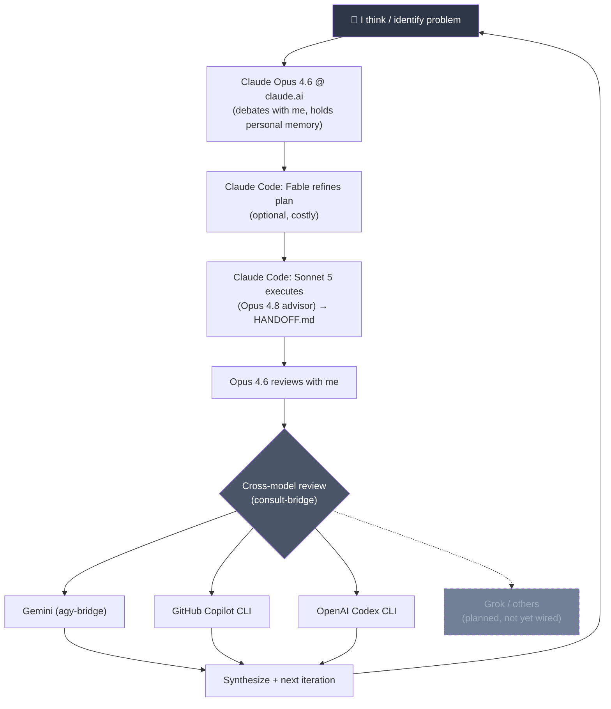

[English](README.md) · **繁體中文**

# claude-bridges

讓 Claude Code 能夠委派任務給其他程式設計 CLI 的 MCP 伺服器 —— 跨模型第二意見、結構化審查，以及多引擎諮詢小組。

大多數人用 AI 來做自動補全或向單一模型問單一問題。我則將多個模型作為具備制衡機制的結構化思考系統：辯論、執行、審查、交叉檢查、迭代。

## 思考循環



這不是「隨便問問 ChatGPT」。每個模型都有其角色、沙盒與審查關卡。沒有任何單一模型的輸出會在未經檢查的情況下直接交付。

## 實際接通的引擎

`consult` 工具目前會扇出至**四個引擎**：

| Engine | Wraps | Tier |
|---|---|---|
| `copilot` | GitHub Copilot CLI (`copilot -p`) | Free (GitHub) |
| `codex` | OpenAI Codex CLI (`codex exec`) | Free (ChatGPT) |
| `agy` | Antigravity / Gemini CLI | Paid (Gemini Pro/Flash) |
| `deepseek` | 以 `deeperseeker` proxy 代理 DeepSeek 網頁帳號（HTTP，非 CLI） | Free（拋棄式帳號） |

`deepseek` 採選用制：不在預設的 `CONSULT_ORDER` 之中，須以 `--order ...,deepseek` 指定，
或將其寫入 `CONSULT_ORDER`。與其他 CLI 引擎不同，它沒有 cwd、shell 或檔案存取權限 ——
只看得到 prompt 文字本身，因此送給它的 prompt 必須自帶完整脈絡。

Grok 與其他模型已列入構想循環中，但尚未建立 bridge。本系統設計具備擴充引擎的能力 —— 每個引擎在 `lib/engines.js` 中僅需約 30 行程式碼。

## 架構

```
claude-bridges/
  package.json            shared deps (@modelcontextprotocol/sdk, zod)
  node_modules/           one install serves all bridges
  lib/
    common.js             shared MCP boilerplate, CLI runner, exe resolution
    engines.js            slim engine runners for consult-bridge's chain
  copilot-bridge/
    index.js              standalone MCP server → copilot_exec tool
  codex-bridge/
    index.js              standalone MCP server → codex_exec tool
  consult-bridge/
    index.js              aggregator MCP server → consult tool
  agy-bridge-vendored/    vendored copy of the agy-bridge (Gemini)
```

三個獨立的 MCP 伺服器，各自可單獨使用或透過 `consult` 聚合器使用：

| Bridge | 工具 | 預設策略 |
|---|---|---|
| `copilot-bridge` | `copilot_exec` | 限制性：禁止寫入檔案，僅自動核准讀取/搜尋/git-gh shell |
| `codex-bridge` | `codex_exec` | 沙盒化 `read-only` |
| `consult-bridge` | `consult` | 聚合器：平行執行所有引擎（`mode: all`）或循序後備切換（`mode: first`） |

`consult-bridge` 特意**沒有**重複使用各個獨立 bridge 的程式碼路徑 —— `lib/engines.js` 複製了約 30 行的引數建構邏輯，以確保已測試過的單一 bridge 承擔零重構風險。

## 工具

### `consult`（核心亮點）

諮詢外部模型小組。具備兩種模式：

- **`all`**（預設）—— 平行執行每個引擎，回傳所有成功的回答並標註所屬引擎。適用於需要觀點多樣性的跨模型第二意見。
- **`first`** —— 循序後備鏈，以第一個成功的回應為主。成本較低，適用於例行問題或額度吃緊時。

```
consult({
  prompt: "Review this auth middleware for timing attacks",
  mode: "all",           // "all" | "first"
  order: ["copilot", "codex", "agy"]  // engine set/chain order
})
```

引擎順序可透過 `order` 引數或 `CONSULT_ORDER` 環境變數設定（預設為 `copilot,codex,agy`）。失敗的引擎（配額耗盡、驗證失敗、逾時、輸出為空、非零結束代碼）會自動容錯移轉至下一個引擎；相關歷程紀錄會附加於結果之後。

### `copilot_exec`

委派給 GitHub Copilot CLI，採無周邊（headless）且非互動式模式。預設為唯讀 —— 可以讀取與搜尋 `cwd` 下的檔案，但無法修改檔案。

### `codex_exec`

透過 `codex exec` 委派給 OpenAI Codex CLI。預設為沙盒化唯讀。只有當你確實打算讓 Codex 編輯檔案時，才傳入 `sandbox: "workspace-write"`。

## 安裝

```powershell
cd ~/claude-bridges
npm install
```

在根目錄執行單次 `npm install` 即可供應所有伺服器 —— Node 會從各個 `index.js` 向上查找來解析 `node_modules`。

## 註冊（使用者範圍）

```powershell
claude mcp add-json copilot-bridge  '{"command":"node","args":["C:/Users/YOU/claude-bridges/copilot-bridge/index.js"],"timeout":600000}' -s user
claude mcp add-json codex-bridge    '{"command":"node","args":["C:/Users/YOU/claude-bridges/codex-bridge/index.js"],"timeout":600000}' -s user
claude mcp add-json consult-bridge  '{"command":"node","args":["C:/Users/YOU/claude-bridges/consult-bridge/index.js"],"timeout":600000}' -s user
```

請將 `C:/Users/YOU` 替換為你的實際家目錄。這三個 CLI 都必須先完成驗證：

```bash
copilot login    # GitHub Copilot CLI
codex login      # OpenAI Codex CLI
# agy: see agy-bridge docs for Gemini auth
```

## 設定（環境變數）

### 通用設定

| 變數 | 預設值 | 說明 |
|---|---|---|
| `*_TIMEOUT` | `600` | 各引擎逾時時間（秒） |
| `*_MAX_OUTPUT_CHARS` | `50000` | 輸出截斷上限字數 |
| `*_MODEL` | （引擎預設） | 覆寫所使用的模型 |
| `*_BIN` | （自動解析） | 覆寫 CLI 執行檔路徑 |

### copilot-bridge

| 變數 | 預設值 | 說明 |
|---|---|---|
| `COPILOT_BRIDGE_PERM_ARGS` | （限制性預設值） | 整批替換權限旗標。JSON 陣列或以空白分隔的字串。在 Copilot 中拒絕規則（Deny）永遠優先於允許規則（Allow）。 |

### codex-bridge

| 變數 | 預設值 | 說明 |
|---|---|---|
| `CODEX_BRIDGE_SANDBOX` | `read-only` | `read-only`、`workspace-write` 或 `danger-full-access`。亦可在每次呼叫時透過 `sandbox` 引數覆寫。 |

### consult-bridge

| 變數 | 預設值 | 說明 |
|---|---|---|
| `CONSULT_TIMEOUT` | `300` | 各引擎逾時時間（秒） |
| `CONSULT_MAX_OUTPUT_CHARS` | `50000` | 總輸出截斷上限字數 |
| `CONSULT_PER_ENGINE_CHARS` | `20000` | `all` 模式下各引擎截斷字數 |
| `CONSULT_ORDER` | `copilot,codex,agy` | 預設引擎順序 |
| `CONSULT_MODE` | `all` | 預設模式（`all` 或 `first`） |
| `DEEPSEEKER_BASE` | `http://127.0.0.1:4000` | deeperseeker proxy 的 base URL |
| `DEEPSEEKER_MODEL` | `v4.1flash` | 傳給 proxy 的 model id |
| `DEEPSEEKER_API_KEY` | （從 proxy `.env` 讀取） | Proxy API key，未設時回退至 `DEEPSEEKER_ENV_PATH` |
| `DEEPSEEKER_ENV_PATH` | `~/Claude/deeperseeker/.env` | 環境變數未設時，從何處讀取金鑰 |

## 為什麼需要這個專案

我從國中就開始動手做東西 —— 最早是 Arduino 草稿碼，現在是 PCB 與交易系統。AI 是我的工具箱與學習循環的一部分：我用 Opus 4.6 思考（天生的規劃者/辯論者），用 Sonnet 5 + Opus 4.8 執行（嚴格的提示詞遵循者，專為交付成果而生），並在任何內容落地前，透過 Gemini、Copilot 與 Codex 進行交叉檢查。

每個模型都有與其訓練方式契合的任務：

- **思考** —— claude.ai 上的 Opus 4.6 保留我的個人記憶、與我辯論各種方案，並在我投入之前對計畫進行壓力測試。它的訓練偏向推理與細微差異的掌握 —— 這正是規劃所需要的。
- **執行** —— Sonnet 5 撰寫程式碼；Opus 4.8 作為顧問進行審查。兩者都受過嚴格遵循提示詞與精確輸出的訓練 —— 它們負責交付成果，而不是空談哲學。
- **交叉檢查** —— `consult` 平行扇出給 Copilot、Codex 與 Gemini。不同的訓練資料、不同的盲點、獨立的評判。沒有任何單一模型能說了算。
- **迭代** —— 所有結果都會回饋給我。由我整合、定奪並開啟下一個循環。人類在每個關卡都保持在控制迴圈中（human-in-the-loop）。

除了模型選擇之外，每次委派都會附帶一個**角色提示詞（role prompt）** ——「身為資安稽核員…」、「身為前端工程師…」、「身為 Karpathy 風格的程式碼審查員…」—— 讓模型能從特定的專業框架回應，而不是當一個泛用的助手。我維護著一份完整的角色表（涵蓋工程、產品、內容與研究等 20 多個角色），將每個角色對應到合適的模型層級與工具。

這些 bridge 就是基礎管線設施，讓交叉檢查得以程式化自動進行 —— 而不需要在各個聊天視窗之間手動複製貼上。
